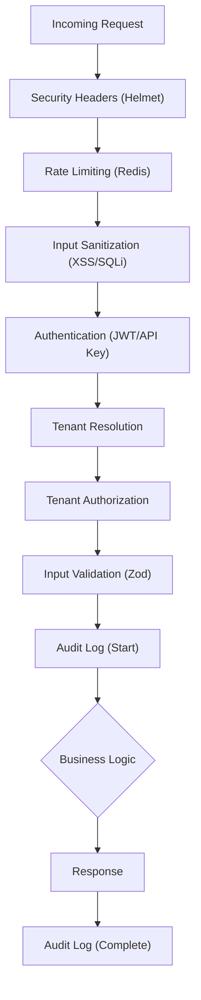

# Tenet Framework
[](https://www.typescriptlang.org/)
[](https://nodejs.org/)
[](https://expressjs.com/)
[](https://prisma.io/)
[](LICENSE)

**The Enterprise-Grade API Framework for Node.js**

Tenet is a **Node.js framework that makes building secure, multi-tenant APIs easy**. 

It automatically handles **authentication, input validation, rate-limiting, and auditing** for every endpoint, so you can focus 100% on writing your application's logic instead of configuring middleware.

## 🧠 Core Philosophy

### 1. Security by Default
In Tenet, security is **opt-out**. By default, every handler you create has:
- Strict input sanitization (XSS/SQLi protection)
- Authentication checks
- CSRF protection
- Rate limiting
- Secure HTTP headers

### 2. Configuration over Boilerplate
Developers spend too much time writing the same 20 lines of middleware setup for every endpoint. Tenet uses a **declarative configuration object** (`HandlerConfig`) to define behavior. You describe *what* you want (e.g., "Authenticated, Rate Limited, Audited"), and the framework constructs the pipeline.

### 3. Type Safety as a First-Class Citizen
The framework leverages TypeScript to its fullest:
- **Input Types**: Derived automatically from Zod schemas.
- **Database Types**: Generated from your Prisma schema.
- **Context Types**: Guaranteed user/tenant presence based on your configuration.

---

## 🏗️ Technical Stack Choices

We chose a "Boring but Proven" technology stack to ensure long-term maintainability and stability.

- **Express.js (The Core)**: The industry standard. We wrap Express to provide modern async features and typed inputs while maintaining access to its massive middleware ecosystem.
- **Prisma (The Data Layer)**: Unmatched developer experience. We utilize Client Extensions to inject Row-Level Security (RLS) directly into the query builder.
- **Zod (Validation)**: The bridge between untyped HTTP JSON and strict TypeScript.
- **Redis (Infrastructure)**: Used for distributed rate limiting and caching.

---

## 🏢 Why use Tenet?

### For Startups
**Speed to MVP.** You get a production-ready foundation with Auth, Multi-Tenancy, and Logging out of the box. You focus 100% on your product's unique value.

### For Enterprises
**Compliance & Standardization.** Tenet enforces patterns that satisfy security audits (SOC2/GDPR). The uniform structure means any developer can jump into any backend system built with Tenet and understand it immediately.

---

## 📚 Documentation

Detailed documentation is available in the `docs/` directory:

- **[API Reference](docs/API.md)**: Main entry point for all exports.
- **[Handler Guide](docs/api/handlers.md)**: How to use `createPublicHandler`, `createAuthenticatedHandler`, etc.
- **[Multi-Tenancy](docs/architecture/multi-tenancy.md)**: Isolation strategies and tenant resolution.
- **[Security Features](docs/security/features.md)**: CSRF, Rate Limiting, Encryption.
- **[Audit System](docs/api/audit.md)**: Compliance logging and identifying users.

---

## ⚡ Quick Start

### 1. Installation

```bash
npm install @tenet/api zod @prisma/client
```

### 2. Create a Public Endpoint

```typescript
import { createPublicHandler, z } from '@tenet/api';

// GET /api/health
export const healthCheck = createPublicHandler({
  schema: z.object({
    echo: z.string().optional(),
  }),
  handler: async ({ input }) => {
    return { status: 'ok', echo: input.echo };
  },
});
```

### 3. Create an Authenticated Endpoint

```typescript
import { createAuthenticatedHandler, z } from '@tenet/api';

// POST /api/profile
export const updateProfile = createAuthenticatedHandler({
  schema: z.object({
    name: z.string().min(2),
  }),
  handler: async ({ input, user, prisma }) => {
    // User is guaranteed to be present and authenticated
    return await prisma.user.update({
      where: { id: user.id },
      data: { name: input.name },
    });
  },
});
```

### 4. Create a Multi-Tenant Endpoint

```typescript
import { createTenantHandler, z } from '@tenet/api';

// GET /api/projects
export const listProjects = createTenantHandler({
  handler: async ({ prisma }) => {
    // Prisma client is automatically scoped to the current tenant!
    // WHERE tenantId = ? is injected automatically.
    return await prisma.project.findMany();
  },
});
```

---

## 🔒 Security Features

- **Authentication**: JWT, API Keys, and OAuth strategies.
- **Sanitization**: Auto-strips dangerous characters from HTML/SQL inputs.
- **Rate Limiting**: Distributed Redis-based limits per user/IP.
- **Encryption**: AES-256 helper for sensitive database fields.
- **Compliance**: SOC2-ready Audit Logs.

## 🏗️ Architecture



## 🤝 Contributing

Please read [CONTRIBUTING.md](CONTRIBUTING.md) for details on our code of conduct and the process for submitting pull requests.

## 📄 License

This project is licensed under the MIT License - see the [LICENSE](LICENSE) file for details.
